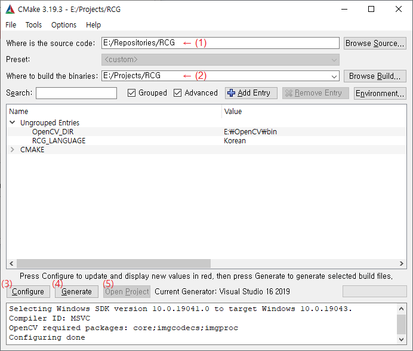
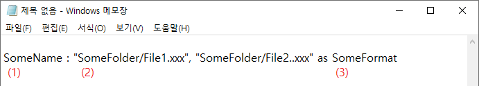

# Resource Collection Generator (KOR)

Resource Collection Generator(RCG)는 저장할 리소스의 이름과 경로가 적인 텍스트 파일을 읽어서 다양한 프로그램에서 이용할 수 있는 리소스 통합 파일을 생성해주는 프로그램입니다.


## 소개

프로그램들은 종종 실행 코드 외에도 이미지나 사운드 등의 자원을 필요로 합니다. 이들은 흔히 실행 파일 외부에 별도의 파일로 저장되며, 사용자가 쉽게 보거나 변경하지 못하도록 png나 mp3등의 잘 알려진 포맷과 파일 확장자 대신 독자적인 파일 포맷을 갖는 경우가 일반적입니다.

RCG는 이러한 외부 리소스 파일을 더 쉽게 만들 수 있게 해 주는 프로그램입니다. 다음과 같은 기능들이 지원됩니다.

- 파일 하나에 여러 개의 리소스를 저장할 수 있습니다. 이는 프로그램이 의존하는 리소스 파일의 수를 줄여서 사용자가 프로그램을 더 쉽게 관리할 수 있게 해 줍니다. 각각의 리소스는 고유의 이름을 가지며 이름을 통해 로드됩니다.
- 일부 리소스의 경우 프로그램에서 이용하기 쉬운 형태로 미리 데이터 포맷을 바꾸어 저장할 수 있습니다. 가령 이미지는 파랑, 초록, 빨강, 알파의 4개의 8비트 채널을 갖는 픽셀당 32비트의 비트맵 형태가 가장 프로그램에서 이용하기 쉬우며, 이것은 Bitmap32라는 이름의 포맷으로 제공됩니다.


## 설치

소스 코드로부터 직접 프로그램을 빌드하려면 아래의 과정을 따르십시오.

1. https://cmake.org 에서 여러분의 운영 체제에 맞는 최신의 Cmake버전을 다운로드하여 설치하십시오. Cmake 3.13 이상 버전이 이미 설치되어 있다면 이 단계는 건너뛰어도 좋습니다.

2. https://opencv.org 에서 여러분의 운영 체제에 맞는 최신의 OpenCV버전을 다운로드하여 설치하십시오. OpenCV 3.0 이상 버전이 이미 설치되어 있다면 이 단계는 건너뛰어도 좋습니다.

3. Github 저장소 (-)를 복제하거나 다운로드하여 알맞은 폴더에 복사합니다.

4. Cmake-gui를 실행시킨 후 (1)에 저장소가 복제된 폴더를, (2)에 프로젝트를 설치할 폴더를 입력하고 (3)을 클릭합니다.

   

5. 대화 상자에서 RCG 프로젝트를 빌드할 때 사용할 빌드 시스템을 선택하십시오. 이 단계를 통과하려면 최소한 하나 이상의 C++ 빌드 시스템이 이미 설치되어 있어야 합니다. 

6. 언어와 기타 옵션을 선택할 수 있는 항목들이 Cmake-gui창 안에 나타나면 언어를 선택하고 다시 (3)을 클릭합니다. 작업이 끝나면 (4)를 클릭하고 다시 작업이 끝나면 (5)를 클릭합니다.

7. 선택한 빌드 시스템을 이용하여 RCG 프로젝트를 빌드합니다. 

빌드가 끝나면 OpenCV가 설치된 폴더에서 core와 imgcodecs, imgproc패키지의 라이브러리 파일 (윈도우의 경우 .dll 확장자로 제공됩니다) 들을 찾아 프로그램이 설치된 폴더에 복사해 넣으십시오. 모든 작업이 끝나면 프로그램을 실행시킬 수 있을 것입니다.


## 사용 방법

### 1) 리소스 만들기

리소스 통합 파일을 생성하려면 리소스 파일에 저장하고자 하는 이미지, 사운드 등의 데이터 파일과 이들로부터 리소스를 어떻게 만들지를 지정할 텍스트 파일이 필요합니다. RCG는 이 텍스트 파일을 읽어서 리소스 파일을 생성합니다.

텍스트 파일 안에는 리소스 통합 파일에 들어갈 각 리소스 항목에 대한 정보들이 여러 줄에 걸쳐서 입력됩니다. 다음 그림은 한 항목을 정의하는 방법을 보여줍니다. 



(1)은 향후 다른 프로그램에서 이 리소스 데이터를 로드할 때 참조할 이름으로, 반드시 입력되어야 하며 중복될 수 없습니다.

(2)는 해당 이름의 리소스에 저장할 파일들의 절대 또는 상대 경로입니다. 반드시 최소 한 개 이상의 경로가 입력되어야 하며, 여러 개의 경로를 입력할 경우 여러 개의 데이터가 배열 형태로 저장됩니다.

(3)은 리소스의 데이터 포맷을 바꾸어 저장하고 싶을 때 사용되며, 생략될 경우 파일 전체가 포맷 변경 없이 바이너리 형태로 저장됩니다. 현재 지원중인 포맷에 대해서는 아래의 표를 참조하십시오.

| Format name | Information                                                  | Required source                   |
| ----------- | ------------------------------------------------------------ | --------------------------------- |
| Bitmap32    | 파랑, 초록, 빨강, 알파(불투명도)가 각각 8bit 채널에 저장되는 32비트 비트맵. | 이미지 파일 (.bmp, .png, .jpg...) |

하나의 리소스는 한 줄 안에 정의되는 것이 보통이지만 여러 개의 리소스를 배열로 저장해야 할 경우 가독성을 위해 줄 바꿈이 필요할 수 있습니다. 줄 바꿈이 필요할 경우 줄 끝에 이스케이프 문자 \\를 넣으십시오. 단, 경로 내부에서의 줄 바꿈은 허용되지 않습니다.

텍스트 파일 작성이 끝나면 작성된 파일을 RCG 실행 파일에 연결하여 실행시키십시오. 윈도우의 경우 그냥 텍스트 파일을 실행 파일 위로 드래그하면 됩니다. .dat 확장자를 가진 리소스 통합 파일을 얻을 수 있습니다.


### 2) 리소스 로드하기

RCG를 통해 생성한 리소스는 src_loader폴더의 헤더 및 소스 파일들을 포함시킨 다른 c++ 프로젝트에서 ResourceCollection클래스의 load메소드를 통해 로드하여 이용할 수 있습니다. 아래의 예제를 참조하십시오.

```c++
#include "ResourceCollection.hpp"
void someFunction() {
    ResourceCollection rc;
    ResourceCollection::ERR_CODE errNo = rc.load("resources.dat");
    
    std::vector<SomeFormat*> SomeNamedResources = rc.getSomeFormatResource("SomeName");
   	...
}
```

기타 사용법 및 여러 세부 사항에 관해서는 src_loader폴더 내의 실제 소스 파일들을 참조하십시오.


## 기여자

<a href="https://github.com/attltb"></a>

<a href="https://github.com/attltb">attltb</a> - 프로그램 설계, 코딩 등 작업 전반

모든 종류의 기여는 환영합니다.
